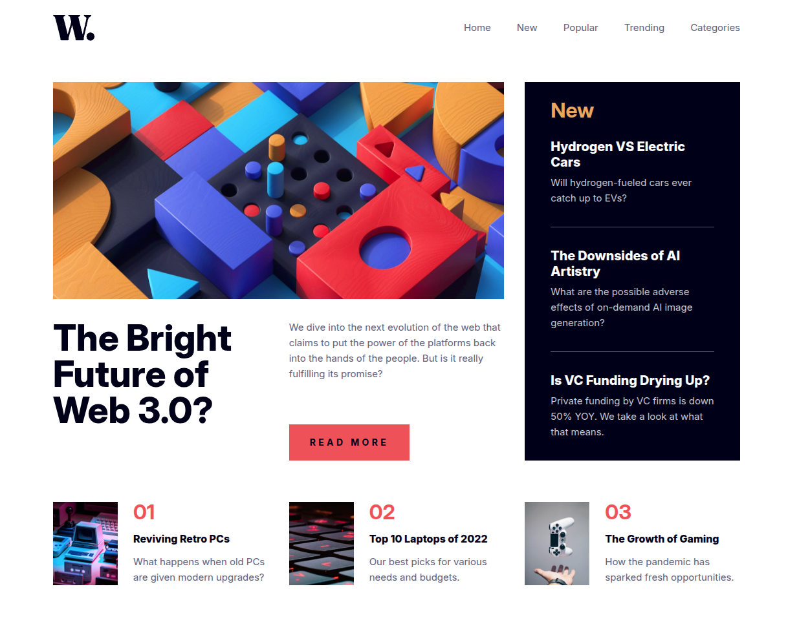
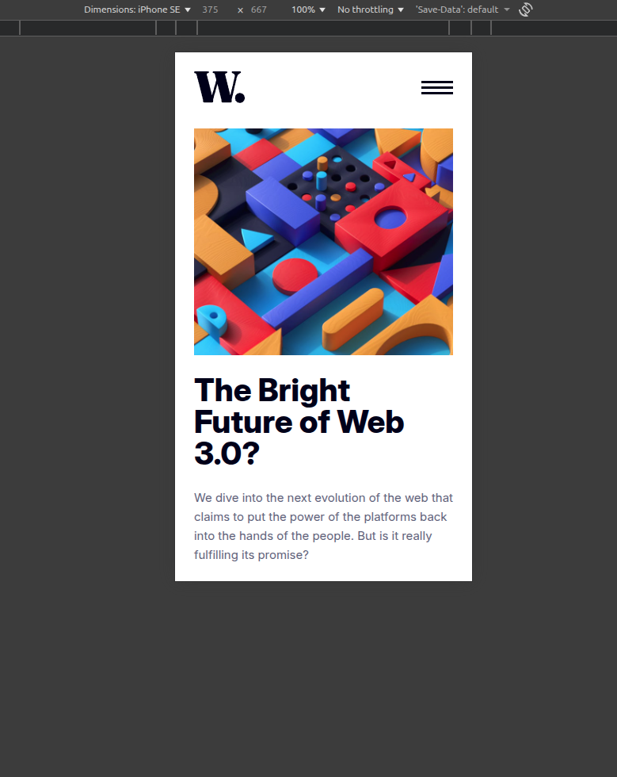

# News Homepage

A homepage for a news website! Feel free to give me a star 😄
 
 
It features a fully responsive homepage.
 
 
I was able to use custom font with **google fonts**, **variables**, **media-queries**, **grid**, **picture/srcset**, **flexbox**, **pseudo-attributes**, **pseudo-elements** and **BEM**.

---

## 📸 Preview

### Desktop

### Tablet

## 

### Mobile

## 

## How to use and customize

1. Clone the repo

`git clone https://github.com/rodrigodvalente/news-homepage.git`

2. Navigate to the directory

`cd news-homepage`

3. Open the `index.html` and customize in your code editor of preference

---

## 🧠 Best practices

I also used Prettier to make the layout better on **VSCode** and used the command line for versioning with Git.